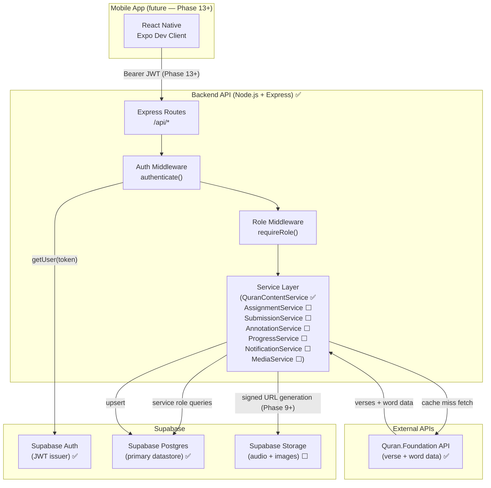

# System Overview

## Component Map

## Status by Layer

| Layer | Status | Notes |
|-------|--------|-------|
| Supabase Auth + DB schema | ✅ | Migrations 001–003 applied |
| Express skeleton + middleware | ✅ | Auth, role, error handler |
| GET /api/me, PATCH /api/me/profile | ✅ | Phase 3 |
| Quran content proxy + cache | ✅ | Phase 4 |
| Supabase Storage integration | ⬜ | Phase 9 |
| Assignment + submission routes | ⬜ | Phase 5 |
| Teacher review + annotations | ⬜ | Phases 6–7 |
| Progress tracking | ⬜ | Phase 8 |
| Notifications | ⬜ | Phase 10 |
| Admin assignment management | ⬜ | Phase 11 |
| React Native mobile app | ⬜ | Phase 13+ |

## Data Ownership Rules (enforced on every route)

- Students access only their own submissions.
- Teachers access only submissions under their assignments.
- Admins and super_admins can read all; only super_admins can change roles.
- Quran.Foundation secrets never leave the backend.
- Supabase service-role key never reaches mobile code.
- Signed URLs are generated on demand; never stored in DB.
