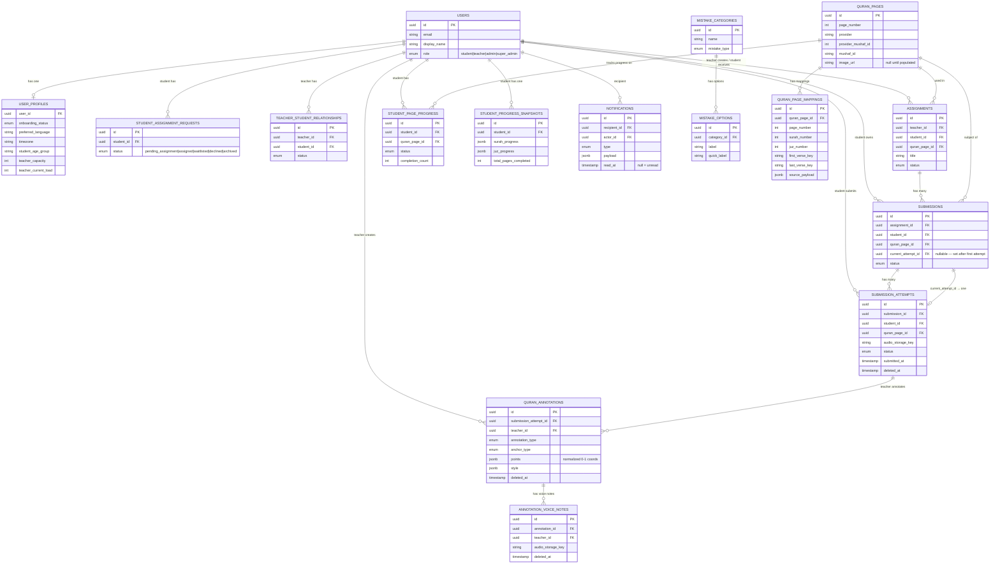

# Database ERD

Ownership structure and relationship flow. Omits index-only columns and timestamps for readability.

## Key Structural Notes

### Circular FK: submissions ↔ submission_attempts

`submissions.current_attempt_id` points into `submission_attempts`, but `submission_attempts.submission_id` also points back to `submissions`. Resolved with deferred ALTER TABLE (migration 001):

1. CREATE `submissions` (no FK on `current_attempt_id`)
2. ALTER TABLE `submissions` ADD unique `(id, student_id, quran_page_id)`
3. CREATE `submission_attempts` with composite FK matching that unique index
4. ALTER TABLE `submissions` ADD FK `current_attempt_id → submission_attempts.id`

### Composite FK on submission_attempts

`submission_attempts(submission_id, student_id, quran_page_id)` must match `submissions(id, student_id, quran_page_id)`. This prevents an attempt from being attached to a different student's submission.

### Source-of-truth tables

| Table | Purpose |
|-------|---------|
| `student_page_progress` | Whether a student completed a page (one row per student+page, never deleted) |
| `submission_attempts` | Each recording (soft-deleted only, never hard-deleted) |
| `quran_annotations` | Teacher feedback (soft-deleted only) |
| `notifications` | In-app notification state (push is best-effort) |
| `student_progress_snapshots` | Derived read model — recalculated in service code after review completion; no DB triggers |
