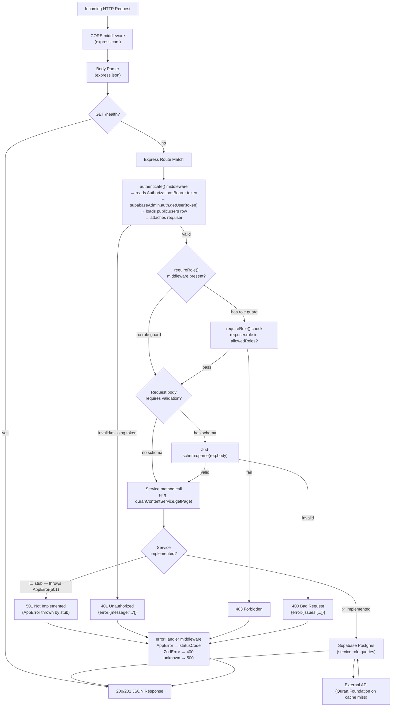

# Backend Request Flow

## Standard Authenticated Request



## Which Routes Are Implemented vs. Stubbed

### ✅ Fully implemented (Phase 3–4)

| Route | Service | Notes |
|-------|---------|-------|
| GET /api/me | inline (no service) | bootstraps user_profiles |
| PATCH /api/me/profile | inline | updates users + user_profiles |
| GET /api/quran/pages/lookup | QuranContentService | cache-first |
| GET /api/quran/pages/:n | QuranContentService | cache-first |
| GET /api/quran/pages/:n/content | QuranContentService | cache-first, optional words |

### ⬜ Registered but stubbed — throw AppError(501)

All other routes are registered (auth guard fires, role guard fires, Zod validates) but the service call hits a stub that throws `AppError(501, 'Not implemented')`. The 501 is surfaced only if a valid, correctly-authorized token is provided. Unauthenticated requests see 401 before the 501 is ever reached.

```
AssignmentService   → POST /api/assignments, GET /api/student/assignments, GET /api/teacher/review-queue
SubmissionService   → POST /api/submissions, GET /api/submissions/:id
AttemptService      → POST /api/submissions/:id/attempts
AnnotationService   → GET/POST /api/attempts/:id/annotations, batch-save, markers, mistake categories
ProgressService     → GET /api/student/progress (and surah/juz sub-routes)
NotificationService → GET /api/notifications, read, read-all, device register
MediaService        → POST /api/uploads/signed-url, GET /api/media/signed-read-url
AdminService        → GET/PATCH /api/admin/assignment-requests, user management
```
