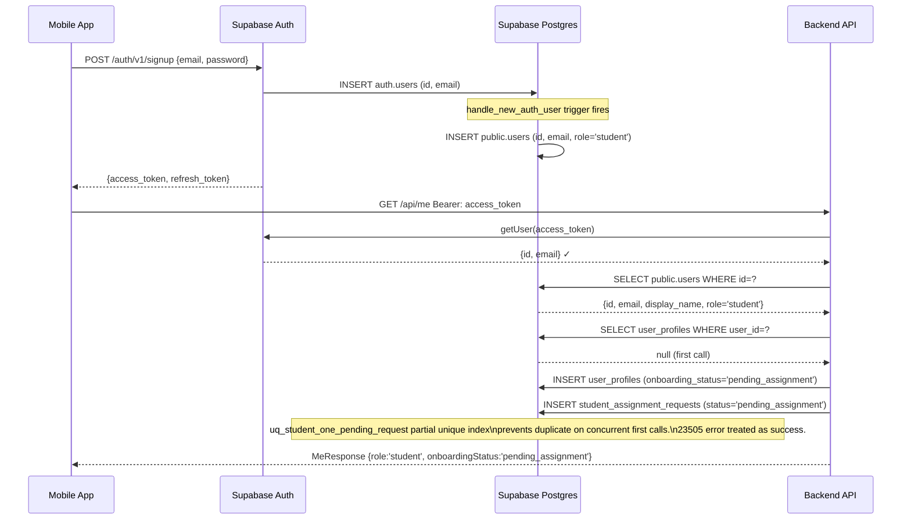

# Auth and Roles Flow

## Sign-up and Profile Bootstrap



## Role Assignment (Admin Flow)

```mermaid
sequenceDiagram
    participant Admin as Admin/Super Admin
    participant BE as Backend API
    participant DB as Supabase Postgres
    participant Student as Student App
    participant Teacher as Teacher App

    Admin->>BE: PATCH /api/admin/users/:id/role  {role:'teacher'}
    Note over BE: requireSuperAdmin guard — only super_admins\ncan change roles
    BE->>DB: UPDATE public.users SET role='teacher'

    Admin->>BE: PATCH /api/admin/assignment-requests/:id {studentId, teacherId}
    BE->>DB: INSERT teacher_student_relationships
    BE->>DB: UPDATE student_assignment_requests SET status='assigned'
    BE->>DB: INSERT notifications (student: assigned_to_teacher)
    BE->>DB: INSERT notifications (teacher: student_assigned)
    Note over BE: push is best-effort; notifications table is source of truth

    Student->>BE: GET /api/me
    BE-->>Student: MeResponse {onboardingStatus:'active'}
    Teacher->>BE: GET /api/teacher/review-queue
    BE-->>Teacher: [assignments with pending submissions]
```

## Role Capability Matrix

| Action | student | teacher | admin | super_admin |
|--------|---------|---------|-------|-------------|
| GET /api/me | ✅ | ✅ | ✅ | ✅ |
| PATCH /api/me/profile | ✅ | ✅ | ✅ | ✅ |
| Submit recitation attempt | ✅ | — | — | — |
| View own submissions | ✅ | — | — | — |
| Create assignment | — | ✅ | ✅ | ✅ |
| View assigned student submissions | — | ✅ | ✅ | ✅ |
| Add annotations | — | ✅ | ✅ | ✅ |
| Mark attempt complete | — | ✅ | ✅ | ✅ |
| View all students | — | — | ✅ | ✅ |
| Manage assignment requests | — | — | ✅ | ✅ |
| Change any user's role | — | — | — | ✅ |

## What Users Cannot Do

- **A student cannot set their own role.** `role` is excluded from `UpdateProfileSchema`. Role changes only happen through `/api/admin/users/:id/role` (`requireSuperAdmin`).
- **A teacher cannot access another teacher's students.** Ownership check on every teacher endpoint: `assignment.teacher_id = req.user.id`.
- **A student cannot access another student's submissions.** `submission.student_id = req.user.id` enforced in service layer.

## Token Lifecycle

Tokens are issued by Supabase Auth and validated on every request by calling `supabaseAdmin.auth.getUser(token)`. The backend does **not** decode JWTs directly — Supabase Auth is the single source of truth for token validity. Refresh is handled by the mobile client (Supabase JS SDK auto-refresh).
