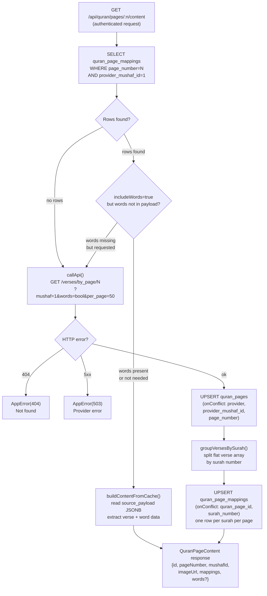

# Quran Content Cache Flow

## Overview

All Quran verse/word data is fetched through the backend proxy only — never directly from mobile. The backend uses a lazy cache-first strategy: pages are populated into Supabase as they are viewed, not pre-loaded.

## Cache-First Request Flow



## getPage vs. getPageContent

| Method | Purpose | API call? |
|--------|---------|-----------|
| `getPage(n)` | Returns page UUID + imageUrl. Creates a minimal DB row on cache miss. Used by assignment creation to resolve a page number to its DB id. | Never |
| `getPageContent(n, includeWords)` | Returns full content: surah mappings + optional word data. Cache-first; falls back to Quran.Foundation on miss. | Only on cache miss |
| `lookupBySurahNumber(n)` | Returns page numbers containing a surah. Cache-first; returns only first page from API on miss. | Only on cache miss |
| `lookupByJuzNumber(n)` | Returns page numbers in a juz. Cache-first; returns only first page from API on miss. | Only on cache miss |

## Data Shape

### Quran.Foundation API response

```
GET /verses/by_page/{pageNumber}?mushaf=1&words=true&per_page=50

{
  verses: [
    {
      id: number,
      verse_key: "1:1",       // "surah:ayah"
      page_number: number,
      juz_number: number,
      words: [
        { id, position, text, line_number, page_number, char_type_name }
      ]
    }
  ]
}
```

### Cached in Supabase

**quran_pages** — one row per (provider, mushaf_id, page_number):
```
id, page_number, provider, provider_mushaf_id, mushaf_id, image_url
```

**quran_page_mappings** — one row per (page, surah):
```
id, quran_page_id, page_number, surah_number, juz_number,
first_verse_key, last_verse_key, starts_at_ayah, ends_at_ayah,
first_verse_id, last_verse_id, verses_count,
source_payload: { verses: [...] }  // includes words if fetched with includeWords=true
```

## Constraints Required

The upsert pattern depends on the unique constraint added in migration 003:

```sql
ALTER TABLE quran_page_mappings
  ADD CONSTRAINT uq_quran_page_mapping_page_surah
  UNIQUE (quran_page_id, surah_number);
```

Without this constraint, re-fetching a cached page would insert duplicate rows instead of updating.

## Auth Mechanism (Pending)

`QuranContentService.buildAuthHeader()` currently implements HTTP Basic auth
(`Authorization: Basic base64(CLIENT_ID:CLIENT_SECRET)`). The exact mechanism
required by Quran.Foundation is not yet confirmed. Possible options:

- **Option A** — OAuth2 client_credentials → POST /oauth/token → Bearer token
- **Option B** — HTTP Basic auth (current placeholder)
- **Option C** — API key header (e.g. `X-API-Key: <CLIENT_SECRET>`)

Update `buildAuthHeader()` once confirmed. If Option A is needed, replace with a
`TokenManager` that caches the access token in memory and refreshes before expiry.

## Mushaf Scope

The backend is hardcoded to mushaf ID 1 (QCF V2 — `QURAN_FOUNDATION_DEFAULT_MUSHAF_ID`).
This is the only supported layout for MVP (blueprint §6.3). Multi-mushaf support
would require parameterizing the mushaf ID through the cache key and all upsert
conflict targets.
