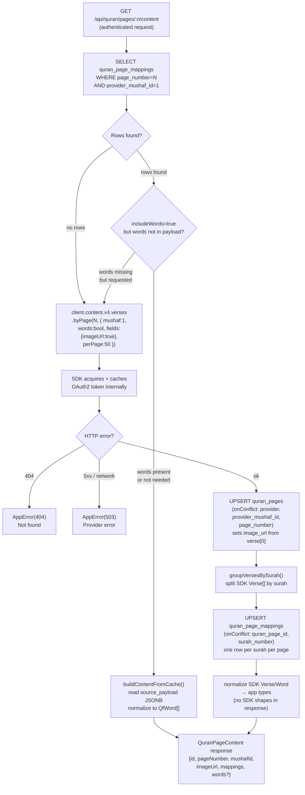

# Quran Content Cache Flow

## Overview

All Quran verse/word data is fetched through the backend proxy only — never directly
from mobile. The backend uses a lazy cache-first strategy: pages are populated into
Supabase as they are viewed, not pre-loaded.

**SDK:** `@quranjs/api@3.2.0` (server entrypoint) handles OAuth2 client-credentials
token acquisition, caching, and refresh automatically. Credentials are stored in
backend env vars and never sent to the mobile app.

```
Mobile App
  → Backend API (Express)
    → QuranContentService
      → @quranjs/api (createServerClient)  ← OAuth2 token managed here
        → Quran.Foundation API
      → normalize SDK response to app types
      → cache/upsert Supabase
      → return app-shaped response to mobile
```

---

## Cache-First Request Flow



---

## Method Summary

| Method | SDK call | Returns | Notes |
|--------|----------|---------|-------|
| `getPage(n)` | none | `QuranPageSummary` | Creates minimal DB row on miss; no API call |
| `getPageContent(n, words)` | `verses.byPage()` | `QuranPageContent` | Cache-first; upserts image_url |
| `lookupBySurahNumber(n)` | `chapters.get()` | `PageLookupResult[]` | Returns **all** pages on miss (via `Chapter.pages`) |
| `lookupByJuzNumber(n)` | `verses.byJuz(n, perPage:1)` | `PageLookupResult[]` | First verse's page number on miss |

---

## SDK Response Normalization

SDK types (from `@quranjs/api`) use camelCase. They are **not exported beyond
`QuranContentService`**. Routes and callers see only our stable app types.

| SDK field | App type field | Notes |
|---|---|---|
| `verse.verseKey` | `mapping.firstVerseKey` / `lastVerseKey` | Split on `:` for ayah numbers |
| `verse.pageNumber` | `pageNumber` | |
| `verse.juzNumber` | `mapping.juzNumber` | |
| `verse.imageUrl` | `quran_pages.image_url` | Only in `VerseField` — must be requested explicitly |
| `word.id` | `QfWord.id` | |
| `word.position` | `QfWord.position` | |
| `word.text` \| `word.textUthmani` | `QfWord.text` | `text` is the default; falls back to `textUthmani` |
| `word.lineNumber` | `QfWord.lineNumber` | |
| `word.pageNumber` | `QfWord.pageNumber` | |
| `word.charTypeName` | `QfWord.charTypeName` | |

---

## Stored Payload Format

`quran_page_mappings.source_payload` stores serialized verse data for cache re-hydration.
It uses our normalized camelCase field names (matching `QfWord`), not raw SDK shapes.

```json
{
  "verses": [
    {
      "id": 1,
      "verseKey": "1:1",
      "pageNumber": 1,
      "juzNumber": 1,
      "words": [
        { "id": 1, "position": 1, "text": "بِسْمِ", "lineNumber": 2, "pageNumber": 1 }
      ]
    }
  ]
}
```

---

## Authentication

The SDK (`createServerClient`) uses OAuth2 client-credentials flow:

1. On first API call, sends `POST /oauth2/token` with `client_id` + `client_secret`
2. Caches the access token in memory (valid for 1 hour)
3. Refreshes automatically before expiry
4. All subsequent calls use the cached token

No token management code exists in `QuranContentService`. The SDK is the token manager.

### Environment configuration

| Env var | Required | Purpose |
|---------|----------|---------|
| `QURAN_FOUNDATION_CLIENT_ID` | ✅ | OAuth2 client ID |
| `QURAN_FOUNDATION_CLIENT_SECRET` | ✅ | OAuth2 client secret — **backend only** |
| `QURAN_FOUNDATION_DEFAULT_MUSHAF_ID` | optional (default: 1) | QCF V2 mushaf |
| `QURAN_FOUNDATION_CONTENT_BASE_URL` | optional | Override for prelive/staging |
| `QURAN_FOUNDATION_OAUTH_BASE_URL` | optional | Override OAuth2 base for prelive/staging |

---

## DB Constraints Required

```sql
-- Idempotent upserts in fetchAndCache require:
ALTER TABLE quran_page_mappings
  ADD CONSTRAINT uq_quran_page_mapping_page_surah
  UNIQUE (quran_page_id, surah_number);
-- Applied in migration 003_add_constraints.sql
```

---

## Mushaf Scope

Hardcoded to mushaf ID 1 (QCF V2) for MVP (blueprint §6.3). Multi-mushaf support
would require parameterizing the mushaf ID through cache keys and upsert conflict targets.
