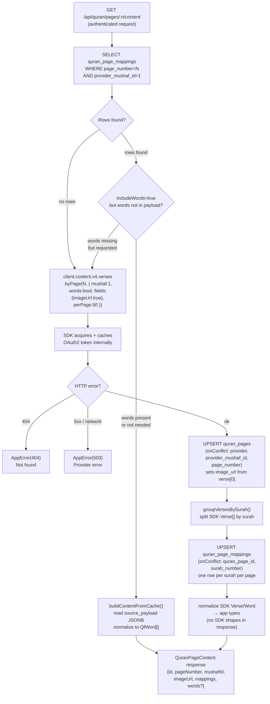

# Quran Content Cache Flow

## Overview

All Quran verse/word data is fetched through the backend proxy only — never directly
from mobile. The backend uses a lazy cache-first strategy: pages are populated into
Supabase as they are viewed, not pre-loaded.

**`@quranjs/api@3.2.0`** is used for TypeScript types only (`import type { Verse, Word, Chapter }`).
All HTTP is handled by `QfTokenManager` (OAuth2 HTTP Basic auth + in-memory token cache) and
`QfApiClient` (sends `x-auth-token` + `x-client-id` headers). Credentials live in backend
env vars and never reach the mobile app.

```
Mobile App
  → Backend API (Express)
    → QuranContentService
      → QfTokenManager  ← POST /oauth2/token with HTTP Basic auth, scope=content
      → QfApiClient     ← GET with x-auth-token + x-client-id headers
        → Quran.Foundation API
      → normalize raw JSON to app types (no SDK shapes exposed)
      → cache/upsert Supabase
      → return app-shaped response to mobile
```

---

## Cache-First Request Flow



---

## Method Summary

| Method | API call | Returns | Notes |
|--------|----------|---------|-------|
| `getPage(n)` | none | `QuranPageSummary` | Creates minimal DB row on miss; no API call |
| `getPageContent(n, words)` | `GET /verses/by_page/{n}` | `QuranPageContent` | Cache-first; upserts image_url |
| `lookupBySurahNumber(n)` | `GET /chapters/{n}` | `PageLookupResult[]` | Returns **all** pages on miss (via `chapter.pages`) |
| `lookupByJuzNumber(n)` | `GET /verses/by_juz/{n}?per_page=1` | `PageLookupResult[]` | First verse's page number on miss |

---

## Raw API Response Normalization

Raw API types (snake_case JSON) are defined as internal interfaces (`RawWord`, `RawVerse`, etc.)
and are **not exported beyond `QuranContentService`**. Routes and callers see only our stable app types.

| SDK field | App type field | Notes |
|---|---|---|
| `verse.verseKey` | `mapping.firstVerseKey` / `lastVerseKey` | Split on `:` for ayah numbers |
| `verse.pageNumber` | `pageNumber` | |
| `verse.juzNumber` | `mapping.juzNumber` | |
| `verse.imageUrl` | `quran_pages.image_url` | Only in `VerseField` — must be requested explicitly |
| `word.id` | `QfWord.id` | |
| `word.position` | `QfWord.position` | |
| `word.text` \| `word.textUthmani` | `QfWord.text` | `text` is the default; falls back to `textUthmani` |
| `word.lineNumber` | `QfWord.lineNumber` | |
| `word.pageNumber` | `QfWord.pageNumber` | |
| `word.charTypeName` | `QfWord.charTypeName` | |

---

## Stored Payload Format

`quran_page_mappings.source_payload` stores serialized verse data for cache re-hydration.
It uses our normalized camelCase field names (matching `QfWord`), not raw SDK shapes.

```json
{
  "verses": [
    {
      "id": 1,
      "verseKey": "1:1",
      "pageNumber": 1,
      "juzNumber": 1,
      "words": [
        { "id": 1, "position": 1, "text": "بِسْمِ", "lineNumber": 2, "pageNumber": 1 }
      ]
    }
  ]
}
```

---

## Authentication

**Why manual HTTP instead of the SDK runtime:**
`@quranjs/api`'s `createServerClient` sends `client_id`/`client_secret` in the form body for token exchange.
The Quran.Foundation OAuth2 server requires **HTTP Basic auth** (`Authorization: Basic base64(id:secret)`).
The SDK has no configuration option to override this, so its token exchange always fails with 401.
`@quranjs/api` is retained as a **type-only import** (`import type { Verse, Word, Chapter }`); all HTTP is
handled by the custom `QfTokenManager` + `QfApiClient` inside `QuranContentService.ts`.

### Token acquisition

```
POST /oauth2/token
Authorization: Basic base64(client_id:client_secret)
Content-Type: application/x-www-form-urlencoded
Body: grant_type=client_credentials&scope=content
```

`QfTokenManager` caches the returned token until 60 seconds before expiry (tokens are valid for 1 hour).
`invalidate()` clears the cache; called automatically on 401 before the one-time retry.

### Content API requests

```
GET /content/api/v4/<path>?<params>
x-auth-token: <access_token>
x-client-id:  <client_id>
Accept: application/json
```

On **401**: token is invalidated, a fresh token is fetched, and the request is retried **once**.
On **404**: `AppError(404)` — propagated as HTTP 404 to caller.
On **other errors**: `AppError(503)` — propagated as HTTP 503.

### `fields` parameter format

The content API accepts `fields=image_url` (comma-separated field names).
URL-bracket notation (`fields[image_url]=true`) is URL-encoded by `URLSearchParams` and causes a 500.

### Environment configuration

| Env var | Required | Purpose |
|---------|----------|---------|
| `QURAN_FOUNDATION_ENV` | ✅ | `prelive` or `production` — selects OAuth2 URL + credentials |
| `QURAN_FOUNDATION_PRELIVE_CLIENT_ID` | ✅ (if prelive) | OAuth2 client ID for prelive |
| `QURAN_FOUNDATION_PRELIVE_CLIENT_SECRET` | ✅ (if prelive) | OAuth2 secret for prelive — **backend only** |
| `QURAN_FOUNDATION_PROD_CLIENT_ID` | ✅ (if production) | OAuth2 client ID for production |
| `QURAN_FOUNDATION_PROD_CLIENT_SECRET` | ✅ (if production) | OAuth2 secret for production — **backend only** |
| `QURAN_FOUNDATION_DEFAULT_MUSHAF_ID` | optional (default: 1) | QCF V2 mushaf |

**Note on prelive tokens:** The prelive OAuth2 server (`prelive-oauth2.quran.foundation`) issues
tokens with issuer `https://prelive-oauth2.quran.foundation`. The content API
(`apis.quran.foundation`) only accepts production-issued tokens. Set `QURAN_FOUNDATION_ENV=production`
for real content API calls. Prelive credentials are useful only for verifying OAuth2 token exchange.

---

## DB Constraints Required

```sql
-- Idempotent upserts in fetchAndCache require:
ALTER TABLE quran_page_mappings
  ADD CONSTRAINT uq_quran_page_mapping_page_surah
  UNIQUE (quran_page_id, surah_number);
-- Applied in migration 003_add_constraints.sql
```

---

## Mushaf Scope

Hardcoded to mushaf ID 1 (QCF V2) for MVP (blueprint §6.3). Multi-mushaf support
would require parameterizing the mushaf ID through cache keys and upsert conflict targets.
