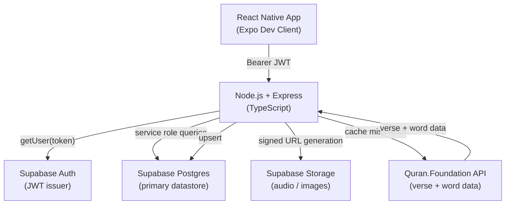
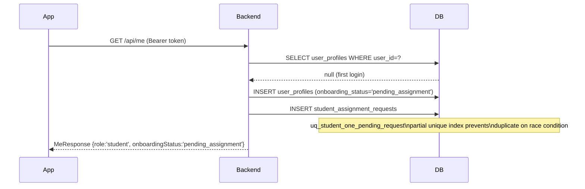
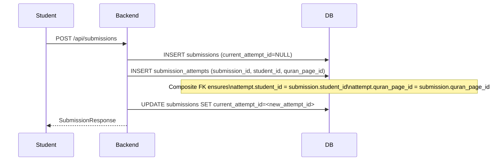
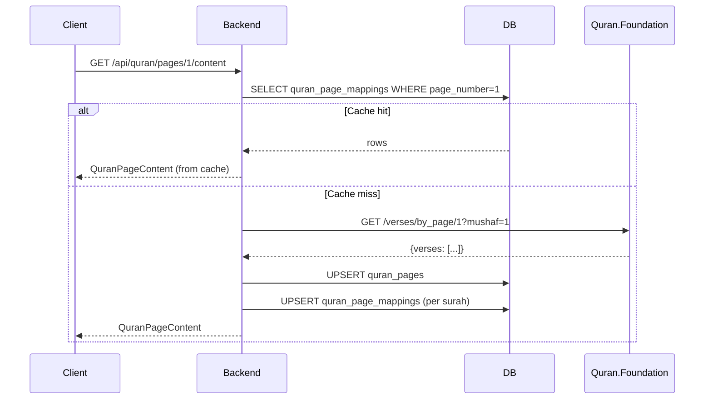

# Phase Progress Map

Tracks which backend routes and services are real implementations vs. stubs, updated after each phase.

## Legend

| Symbol | Meaning |
|--------|---------|
| ✅ | Fully implemented and reviewed |
| 🔧 | In progress / current phase |
| ⬜ | Stub — returns 501 Not Implemented |
| 🔒 | Requires auth middleware (implemented) |

---

## Phase Status

| Phase | Scope | Status |
|-------|-------|--------|
| 0 | Project plan, monorepo scaffold, CLAUDE.md | ✅ |
| 1 | DB schema (001_initial_schema.sql) + seed (002_seed_data.sql) | ✅ |
| 2 | Express skeleton, all stubs, middleware | ✅ |
| 3 | Auth middleware, GET /api/me, PATCH /api/me/profile | ✅ |
| 4 | QuranContentService, 003_add_constraints.sql | ✅ |
| 5 | Assignments, Submissions, Attempts | ⬜ |
| 6 | Teacher review flow | ⬜ |
| 7 | Annotations | ⬜ |
| 8 | Progress tracking | ⬜ |
| 9 | Media (audio upload, storage) | ⬜ |
| 10 | Notifications | ⬜ |
| 11 | Admin assignment management | ⬜ |
| 12 | Mistake feedback | ⬜ |
| 13 | React Native mobile app | ⬜ |
| 14 | Polish, E2E testing, launch prep | ⬜ |

---

## Route Implementation Map

### Auth & Profile (Phase 3)

| Method | Route | Status | Guard |
|--------|-------|--------|-------|
| GET | /api/me | ✅ | 🔒 authenticate |
| PATCH | /api/me/profile | ✅ | 🔒 authenticate |

### Quran Content (Phase 4)

| Method | Route | Status | Guard |
|--------|-------|--------|-------|
| GET | /api/quran/pages/lookup | ✅ | 🔒 authenticate |
| GET | /api/quran/pages/:pageNumber | ✅ | 🔒 authenticate |
| GET | /api/quran/pages/:pageNumber/content | ✅ | 🔒 authenticate |

### Assignments (Phase 5)

| Method | Route | Status | Guard |
|--------|-------|--------|-------|
| GET | /api/assignments | ⬜ | 🔒 authenticate |
| POST | /api/assignments | ⬜ | 🔒 requireTeacherOrAbove |
| GET | /api/assignments/:id | ⬜ | 🔒 authenticate |
| PATCH | /api/assignments/:id | ⬜ | 🔒 requireTeacherOrAbove |

### Submissions (Phase 5)

| Method | Route | Status | Guard |
|--------|-------|--------|-------|
| GET | /api/submissions | ⬜ | 🔒 authenticate |
| POST | /api/submissions | ⬜ | 🔒 authenticate |
| GET | /api/submissions/:id | ⬜ | 🔒 authenticate |

### Submission Attempts (Phase 5)

| Method | Route | Status | Guard |
|--------|-------|--------|-------|
| POST | /api/submissions/:id/attempts | ⬜ | 🔒 authenticate (student) |
| GET | /api/submissions/:id/attempts/:attemptId | ⬜ | 🔒 authenticate |

### Teacher Review (Phase 6)

| Method | Route | Status | Guard |
|--------|-------|--------|-------|
| PATCH | /api/attempts/:id/review | ⬜ | 🔒 requireTeacherOrAbove |
| POST | /api/attempts/:id/voice-notes | ⬜ | 🔒 requireTeacherOrAbove |

### Annotations (Phase 7)

| Method | Route | Status | Guard |
|--------|-------|--------|-------|
| GET | /api/attempts/:id/annotations | ⬜ | 🔒 authenticate |
| POST | /api/attempts/:id/annotations | ⬜ | 🔒 requireTeacherOrAbove |
| DELETE | /api/attempts/:id/annotations/:annotationId | ⬜ | 🔒 requireTeacherOrAbove |

### Progress (Phase 8)

| Method | Route | Status | Guard |
|--------|-------|--------|-------|
| GET | /api/progress/me | ⬜ | 🔒 authenticate |
| GET | /api/progress/:studentId | ⬜ | 🔒 requireTeacherOrAbove |

### Media (Phase 9)

| Method | Route | Status | Guard |
|--------|-------|--------|-------|
| POST | /api/media/upload-url | ⬜ | 🔒 authenticate |
| GET | /api/media/:key/url | ⬜ | 🔒 authenticate |

### Notifications (Phase 10)

| Method | Route | Status | Guard |
|--------|-------|--------|-------|
| GET | /api/notifications | ⬜ | 🔒 authenticate |
| PATCH | /api/notifications/:id/read | ⬜ | 🔒 authenticate |

### Admin (Phase 11)

| Method | Route | Status | Guard |
|--------|-------|--------|-------|
| GET | /api/admin/assignment-requests | ⬜ | 🔒 requireAdmin |
| PATCH | /api/admin/assignment-requests/:id | ⬜ | 🔒 requireAdmin |
| GET | /api/admin/users | ⬜ | 🔒 requireAdmin |
| PATCH | /api/admin/users/:id/role | ⬜ | 🔒 requireSuperAdmin |

---

## Architecture Overview

---

## Key Data Flow: New Student First Login

---

## Key Data Flow: Submission + Attempt Creation

---

## Key Data Flow: Quran Content (Cache-First)

---

## Database Constraint Notes

| Constraint | Table | Purpose |
|-----------|-------|---------|
| `uq_student_one_pending_request` | student_assignment_requests | One pending request per student |
| `uq_student_one_assigned_request` | student_assignment_requests | One assigned request per student |
| `uq_quran_page_mapping_page_surah` | quran_page_mappings | Idempotent upserts from QuranContentService |
| `fk_attempt_submission_student_page` | submission_attempts | Composite FK: attempt must match parent submission's student + page |
| `fk_submissions_current_attempt` | submissions | current_attempt_id → submission_attempts.id |
